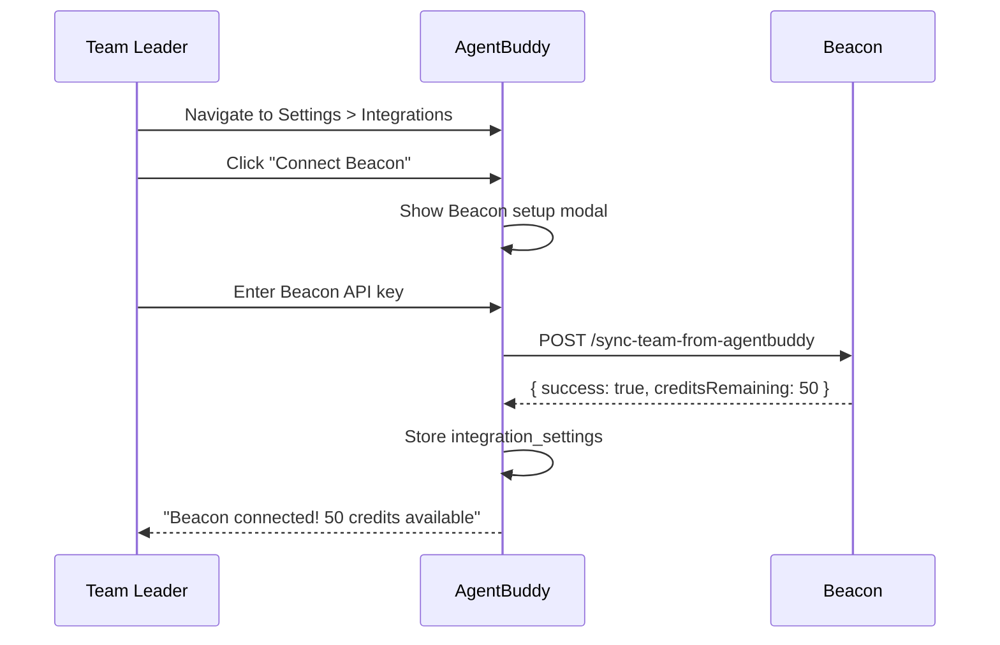
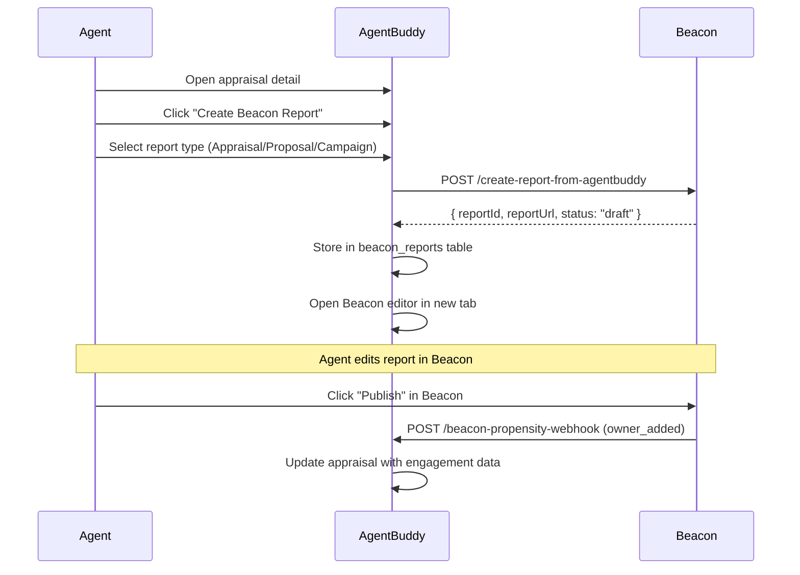
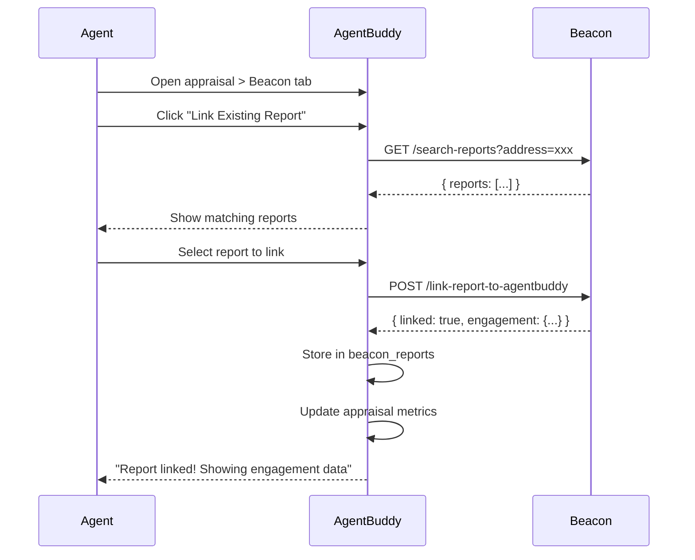

# Beacon Integration Specification v2.0

**Version:** 2.0  
**Date:** December 2024  
**Status:** Ready for Implementation  
**Authors:** AgentBuddy Team

---

## Table of Contents

1. [Executive Summary](#1-executive-summary)
2. [Architecture Principles](#2-architecture-principles)
3. [Data Ownership Model](#3-data-ownership-model)
4. [API Contract - Beacon Must Implement](#4-api-contract---beacon-must-implement)
5. [API Contract - AgentBuddy Must Implement](#5-api-contract---agentbuddy-must-implement)
6. [Historic Import Flow](#6-historic-import-flow)
7. [User Experience Flows](#7-user-experience-flows)
8. [Naming Conventions](#8-naming-conventions)
9. [Error Handling](#9-error-handling)
10. [Security Requirements](#10-security-requirements)
11. [Database Schemas](#11-database-schemas)
12. [Test Scenarios](#12-test-scenarios)
13. [Implementation Checklist](#13-implementation-checklist)
14. [Remaining Questions](#14-remaining-questions)

---

## 1. Executive Summary

This specification defines the bidirectional integration between AgentBuddy (lead management platform) and Beacon (vendor engagement reporting platform). The integration enables real estate agents to:

- Create Beacon reports directly from appraisal records
- Track vendor engagement (views, propensity scores) within AgentBuddy
- Link existing Beacon reports to AgentBuddy leads
- Import historic Beacon data for existing users

### Key Design Decisions

| Decision | Rationale |
|----------|-----------|
| AgentBuddy is source of truth for lead data | Single point of data management |
| Beacon is source of truth for engagement data | Specialized tracking capabilities |
| `externalLeadId` = AgentBuddy's `appraisal.id` | Canonical linking identifier |
| camelCase for all API fields | Consistency across systems |
| Team-scoped authorization | Multi-tenant security |

---

## 2. Architecture Principles

### 2.1 Data Flow Direction

```
┌─────────────────┐                      ┌─────────────────┐
│   AgentBuddy    │                      │     Beacon      │
│                 │                      │                 │
│  ┌───────────┐  │   sync-team          │  ┌───────────┐  │
│  │   Team    │──┼──────────────────────┼─▶│   Team    │  │
│  └───────────┘  │                      │  └───────────┘  │
│                 │                      │                 │
│  ┌───────────┐  │   create-report      │  ┌───────────┐  │
│  │ Appraisal │──┼──────────────────────┼─▶│  Report   │  │
│  └───────────┘  │                      │  └───────────┘  │
│                 │                      │                 │
│  ┌───────────┐  │   webhook            │  ┌───────────┐  │
│  │ Beacon    │◀─┼──────────────────────┼──│Engagement │  │
│  │ Metrics   │  │                      │  │  Events   │  │
│  └───────────┘  │                      │  └───────────┘  │
└─────────────────┘                      └─────────────────┘
```

### 2.2 Core Principles

1. **AgentBuddy Initiates** - All connections initiated from AgentBuddy side
2. **One-Click Experience** - Minimal friction for agent workflows
3. **Bidirectional Sync** - Lead data flows out, engagement data flows back
4. **Team Scoped** - All operations scoped to team for security
5. **Idempotent Operations** - Safe to retry any API call

---

## 3. Data Ownership Model

### 3.1 Entity Mapping

```
AgentBuddy Entity          Beacon Entity              Link Field
─────────────────          ─────────────              ──────────
profiles.id           ──▶  agents.agentbuddy_user_id
teams.id              ──▶  teams.agentbuddy_team_id
logged_appraisals.id  ──▶  report_owners.external_lead_id
beacon_reports.id     ◀──  reports.id
```

### 3.2 Field Ownership

| Field | Owner | Sync Direction |
|-------|-------|----------------|
| Vendor name, email, phone | AgentBuddy | AgentBuddy → Beacon |
| Property address | AgentBuddy | AgentBuddy → Beacon |
| Propensity score | Beacon | Beacon → AgentBuddy |
| View count, time spent | Beacon | Beacon → AgentBuddy |
| Email opens | Beacon | Beacon → AgentBuddy |
| Hot lead status | Beacon | Beacon → AgentBuddy |

---

## 4. API Contract - Beacon Must Implement

### 4.1 POST `/functions/v1/sync-team-from-agentbuddy`

Syncs team and agent information from AgentBuddy to Beacon.

**Request:**
```json
{
  "apiKey": "beacon_api_key_here",
  "teamId": "uuid-of-agentbuddy-team",
  "teamName": "Mark & Co.",
  "agencyName": "Ray White Austar",
  "agents": [
    {
      "userId": "uuid-of-agent",
      "email": "mark@raywhite.com",
      "fullName": "Mark Bryant",
      "avatarUrl": "https://...",
      "role": "team_leader"
    }
  ]
}
```

**Success Response (200):**
```json
{
  "success": true,
  "beaconTeamId": "uuid-of-beacon-team",
  "syncedAgents": 3,
  "creditsRemaining": 47,
  "subscriptionStatus": "active"
}
```

**Error Response (400):**
```json
{
  "success": false,
  "error": "INVALID_API_KEY",
  "message": "The provided API key is invalid or expired"
}
```

---

### 4.2 POST `/functions/v1/create-report-from-agentbuddy`

Creates a new Beacon report from AgentBuddy appraisal data.

**Request:**
```json
{
  "apiKey": "beacon_api_key_here",
  "teamId": "uuid-of-agentbuddy-team",
  "externalLeadId": "uuid-of-appraisal",
  "reportType": "appraisal",
  "propertyAddress": "123 Queen Street, Auckland CBD, Auckland 1010",
  "suburb": "Auckland CBD",
  "vendorName": "John Smith",
  "vendorEmail": "john@example.com",
  "vendorMobile": "+64 21 123 4567",
  "estimatedValue": 1250000,
  "appraisalRangeLow": 1200000,
  "appraisalRangeHigh": 1300000,
  "agentEmail": "mark@raywhite.com",
  "agentName": "Mark Bryant"
}
```

**Report Types:**
- `appraisal` - Market Appraisal report
- `proposal` - Listing Proposal
- `campaign` - Campaign Update/Re-engagement

**Success Response (201):**
```json
{
  "success": true,
  "reportId": "uuid-of-beacon-report",
  "propertySlug": "123-queen-street-auckland-cbd",
  "reportUrl": "https://beacon.app/reports/abc123/edit",
  "personalizedUrl": "https://beacon.app/r/abc123",
  "status": "draft",
  "creditUsed": false
}
```

**Notes:**
- Draft reports do NOT consume credits
- Credit consumed only when report is published in Beacon UI
- `reportUrl` opens editor, `personalizedUrl` is vendor-facing view

---

### 4.3 GET `/functions/v1/search-reports`

Searches for existing Beacon reports by property or owner details.

**Request (Query Parameters):**
```
GET /functions/v1/search-reports?apiKey=xxx&teamId=xxx&address=123%20Queen
```

| Parameter | Required | Description |
|-----------|----------|-------------|
| `apiKey` | Yes | Beacon API key |
| `teamId` | Yes | AgentBuddy team UUID |
| `address` | No* | Property address (partial match) |
| `ownerName` | No* | Vendor/owner name |
| `ownerEmail` | No* | Vendor/owner email |

*At least one search parameter required

**Success Response (200):**
```json
{
  "success": true,
  "reports": [
    {
      "id": "uuid-of-report",
      "address": "123 Queen Street, Auckland CBD, Auckland 1010",
      "propertySlug": "123-queen-street-auckland-cbd",
      "reportType": "appraisal",
      "ownerName": "John Smith",
      "ownerEmail": "john@example.com",
      "createdAt": "2024-06-15T10:30:00Z",
      "agentEmail": "mark@raywhite.com",
      "isLinkedToAgentbuddy": false,
      "externalLeadId": null,
      "status": "published",
      "totalViews": 12,
      "propensityScore": 45,
      "totalTimeSeconds": 340,
      "emailOpenCount": 3,
      "firstViewedAt": "2024-06-16T09:00:00Z",
      "lastViewedAt": "2024-07-01T14:20:00Z"
    }
  ],
  "total": 1
}
```

**Error Response (400) - Team Not Synced:**
```json
{
  "success": false,
  "error": "TEAM_NOT_SYNCED",
  "message": "Team must be synced before searching reports"
}
```

---

### 4.4 POST `/functions/v1/link-report-to-agentbuddy`

Links an existing Beacon report to an AgentBuddy appraisal.

**Request:**
```json
{
  "apiKey": "beacon_api_key_here",
  "reportId": "uuid-of-beacon-report",
  "externalLeadId": "uuid-of-appraisal",
  "vendorName": "John Smith",
  "vendorEmail": "john@example.com",
  "vendorMobile": "+64 21 123 4567"
}
```

**Alternative - Link by Property Slug:**
```json
{
  "apiKey": "beacon_api_key_here",
  "propertySlug": "123-queen-street-auckland-cbd",
  "reportType": "appraisal",
  "externalLeadId": "uuid-of-appraisal",
  "vendorName": "John Smith"
}
```

**Success Response (200):**
```json
{
  "success": true,
  "reportId": "uuid-of-beacon-report",
  "linked": true,
  "engagement": {
    "totalViews": 12,
    "propensityScore": 45,
    "totalTimeSeconds": 340,
    "emailOpenCount": 3,
    "firstViewedAt": "2024-06-16T09:00:00Z",
    "lastViewedAt": "2024-07-01T14:20:00Z",
    "isHotLead": false
  }
}
```

**Critical Behavior:**
- ✅ All existing engagement data is PRESERVED
- ✅ Future engagement triggers webhooks to AgentBuddy
- ✅ Safe to call multiple times (idempotent)

---

### 4.5 GET `/functions/v1/get-all-team-reports` (NEW)

Retrieves all reports for a team, used for historic import.

**Request (Query Parameters):**
```
GET /functions/v1/get-all-team-reports?apiKey=xxx&teamId=xxx&limit=50&offset=0
```

| Parameter | Required | Default | Description |
|-----------|----------|---------|-------------|
| `apiKey` | Yes | - | Beacon API key |
| `teamId` | Yes | - | AgentBuddy team UUID |
| `limit` | No | 50 | Max reports per page (max 100) |
| `offset` | No | 0 | Pagination offset |
| `includeLinked` | No | true | Include already-linked reports |
| `status` | No | all | Filter: `draft`, `published`, `all` |

**Success Response (200):**
```json
{
  "success": true,
  "reports": [
    {
      "id": "uuid-of-report",
      "address": "123 Queen Street, Auckland CBD",
      "propertySlug": "123-queen-street-auckland-cbd",
      "reportType": "appraisal",
      "status": "published",
      "createdAt": "2024-06-15T10:30:00Z",
      "ownerName": "John Smith",
      "ownerEmail": "john@example.com",
      "agentEmail": "mark@raywhite.com",
      "externalLeadId": null,
      "isLinkedToAgentbuddy": false,
      "engagement": {
        "totalViews": 12,
        "propensityScore": 45,
        "totalTimeSeconds": 340,
        "emailOpenCount": 3,
        "firstViewedAt": "2024-06-16T09:00:00Z",
        "lastViewedAt": "2024-07-01T14:20:00Z",
        "isHotLead": false
      }
    }
  ],
  "total": 50,
  "hasMore": true,
  "nextOffset": 50
}
```

---

### 4.6 POST `/functions/v1/sync-owner-from-agentbuddy` (NEW)

Updates owner/vendor details for a linked report.

**Request:**
```json
{
  "apiKey": "beacon_api_key_here",
  "externalLeadId": "uuid-of-appraisal",
  "vendorName": "John Smith",
  "vendorEmail": "john.smith@newemail.com",
  "vendorMobile": "+64 21 999 8888",
  "propertyAddress": "123 Queen Street, Auckland CBD"
}
```

**Success Response (200):**
```json
{
  "success": true,
  "updated": true,
  "reportsUpdated": 2
}
```

---

## 5. API Contract - AgentBuddy Must Implement

### 5.1 POST `/functions/v1/beacon-propensity-webhook`

Receives engagement events from Beacon.

**Request:**
```json
{
  "apiKey": "agentbuddy_webhook_key",
  "eventType": "propensity_update",
  "externalLeadId": "uuid-of-appraisal",
  "reportType": "appraisal",
  "data": {
    "propensityScore": 72,
    "totalViews": 15,
    "totalTimeSeconds": 480,
    "emailOpenCount": 5,
    "isHotLead": true,
    "firstViewedAt": "2024-06-16T09:00:00Z",
    "lastViewedAt": "2024-07-05T11:30:00Z"
  },
  "occurredAt": "2024-07-05T11:30:00Z"
}
```

**Event Types:**

| eventType | Trigger | Data Included |
|-----------|---------|---------------|
| `view` | Report viewed by vendor | viewDuration, totalViews |
| `propensity_update` | Score recalculated | propensityScore, isHotLead |
| `email_open` | Vendor opens email | emailOpenCount |
| `link_click` | Vendor clicks CTA | linkLabel, clickCount |
| `owner_added` | New owner added in Beacon | ownerName, ownerEmail |

**Success Response (200):**
```json
{
  "success": true,
  "processed": true
}
```

**Headers Required:**
```
X-Idempotency-Key: unique-event-id
Content-Type: application/json
```

---

## 6. Historic Import Flow

For teams with existing Beacon reports created before integration, AgentBuddy provides a guided import wizard.

### 6.1 Import Wizard Flow

```
┌─────────────────────────────────────────────────────────────────┐
│                     STEP 1: Fetch Reports                       │
│  ┌─────────────────────────────────────────────────────────┐   │
│  │  Loading 47 Beacon reports for your team...              │   │
│  │  ████████████████████░░░░░░░░░░░░  65%                  │   │
│  └─────────────────────────────────────────────────────────┘   │
└─────────────────────────────────────────────────────────────────┘
                              ▼
┌─────────────────────────────────────────────────────────────────┐
│                   STEP 2: Smart Matching                        │
│  ┌─────────────────────────────────────────────────────────┐   │
│  │  Found 47 Beacon Reports                                 │   │
│  │  ├── 23 matched to existing appraisals (auto-link)      │   │
│  │  ├── 12 no match found (import as new)                   │   │
│  │  └── 12 need review (similar addresses found)            │   │
│  └─────────────────────────────────────────────────────────┘   │
└─────────────────────────────────────────────────────────────────┘
                              ▼
┌─────────────────────────────────────────────────────────────────┐
│                  STEP 3: Review Matches                         │
│  ┌─────────────────────────────────────────────────────────┐   │
│  │  🔗 AUTO-LINK (23)  │  📥 IMPORT (12)  │  ⚠️ REVIEW (12) │   │
│  ├─────────────────────────────────────────────────────────┤   │
│  │  ⚠️ 45 Queen St, Ponsonby                               │   │
│  │     Beacon: "45 Queen Street, Ponsonby, Auckland"        │   │
│  │     Similar: "45 Queen St, Ponsonby" (85% match)         │   │
│  │     [Link to this] [Import as new] [Skip]                │   │
│  └─────────────────────────────────────────────────────────┘   │
└─────────────────────────────────────────────────────────────────┘
                              ▼
┌─────────────────────────────────────────────────────────────────┐
│                    STEP 4: Confirm Import                       │
│  ┌─────────────────────────────────────────────────────────┐   │
│  │  Ready to import:                                        │   │
│  │  • 35 reports will be linked to existing appraisals      │   │
│  │  • 10 reports will create new appraisals                 │   │
│  │  • 2 reports skipped                                     │   │
│  │                                                          │   │
│  │  Engagement data will be synced for all linked reports.  │   │
│  │                                                          │   │
│  │           [Cancel]  [Start Import]                       │   │
│  └─────────────────────────────────────────────────────────┘   │
└─────────────────────────────────────────────────────────────────┘
```

### 6.2 Address Matching Algorithm

**Match Confidence Levels:**

| Level | Confidence | Action |
|-------|------------|--------|
| High | 95%+ | Auto-link (exact or normalized match) |
| Medium | 80-94% | Suggest with confirmation |
| Low | 60-79% | Show in review queue |
| No Match | <60% | Import as new appraisal |

**Normalization Rules:**
- Street → St, Road → Rd, Avenue → Ave, etc.
- Case insensitive comparison
- Remove extra whitespace
- Parse unit numbers separately

---

## 7. User Experience Flows

### 7.1 Enable Integration



### 7.2 Create Report from Appraisal



### 7.3 Link Existing Report



---

## 8. Naming Conventions

### 8.1 API Field Names

**All API fields use camelCase:**

| ✅ Correct | ❌ Incorrect |
|-----------|-------------|
| `apiKey` | `api_key` |
| `teamId` | `team_id` |
| `externalLeadId` | `external_lead_id` |
| `vendorName` | `vendor_name` |
| `reportType` | `report_type` |
| `propertySlug` | `property_slug` |
| `createdAt` | `created_at` |
| `totalViews` | `total_views` |
| `propensityScore` | `propensity_score` |
| `isHotLead` | `is_hot_lead` |

### 8.2 Report Types

| Value | Display Name | Description |
|-------|--------------|-------------|
| `appraisal` | Market Appraisal | Initial property valuation report |
| `proposal` | Proposal | Listing proposal document |
| `campaign` | Campaign Update | Re-engagement or market update |

### 8.3 Event Types (Webhooks)

| Value | Trigger |
|-------|---------|
| `view` | Vendor views report |
| `propensity_update` | Score recalculated |
| `email_open` | Email notification opened |
| `link_click` | CTA button clicked |
| `owner_added` | New owner added in Beacon |

---

## 9. Error Handling

### 9.1 Standard Error Response

```json
{
  "success": false,
  "error": "ERROR_CODE",
  "message": "Human-readable description",
  "details": {}
}
```

### 9.2 Error Codes

| Code | HTTP Status | Description | Resolution |
|------|-------------|-------------|------------|
| `INVALID_API_KEY` | 401 | API key invalid or expired | Check API key in settings |
| `TEAM_NOT_SYNCED` | 400 | Team not synced to Beacon | Call sync-team first |
| `TEAM_NOT_FOUND` | 404 | Team doesn't exist in Beacon | Re-sync team |
| `REPORT_NOT_FOUND` | 404 | Report ID doesn't exist | Verify report ID |
| `ALREADY_LINKED` | 409 | Report already linked to another lead | Unlink first or use different report |
| `INSUFFICIENT_CREDITS` | 402 | No credits remaining | Purchase more credits |
| `RATE_LIMITED` | 429 | Too many requests | Retry after delay |
| `VALIDATION_ERROR` | 400 | Invalid request data | Check request format |
| `INTERNAL_ERROR` | 500 | Beacon server error | Retry or contact support |

---

## 10. Security Requirements

### 10.1 Authentication

| Endpoint Type | Auth Method |
|--------------|-------------|
| Beacon API calls | `apiKey` in request body |
| AgentBuddy webhooks | `apiKey` + `X-Idempotency-Key` header |

### 10.2 Authorization

- All Beacon endpoints verify `teamId` matches API key owner
- Cross-team access is forbidden
- Reports only accessible by team that created them

### 10.3 Webhook Security

```typescript
// AgentBuddy webhook validation
const isValidWebhook = (req: Request): boolean => {
  const apiKey = req.body.apiKey;
  const idempotencyKey = req.headers['x-idempotency-key'];
  
  return (
    apiKey === process.env.BEACON_WEBHOOK_KEY &&
    idempotencyKey && idempotencyKey.length > 0
  );
};
```

### 10.4 Idempotency

- All webhooks include `X-Idempotency-Key` header
- AgentBuddy tracks processed keys to prevent duplicates
- Keys can be safely retired after 24 hours

---

## 11. Database Schemas

### 11.1 AgentBuddy Tables

**beacon_reports:**
```sql
CREATE TABLE beacon_reports (
  id UUID PRIMARY KEY DEFAULT gen_random_uuid(),
  appraisal_id UUID REFERENCES logged_appraisals(id) ON DELETE CASCADE,
  beacon_report_id TEXT NOT NULL,
  report_type TEXT DEFAULT 'appraisal',
  report_url TEXT,
  personalized_url TEXT,
  property_slug TEXT,
  status TEXT DEFAULT 'draft',
  
  -- Engagement metrics (updated via webhook)
  total_views INTEGER DEFAULT 0,
  propensity_score INTEGER DEFAULT 0,
  total_time_seconds INTEGER DEFAULT 0,
  email_opens INTEGER DEFAULT 0,
  is_hot_lead BOOLEAN DEFAULT false,
  first_viewed_at TIMESTAMPTZ,
  last_activity TIMESTAMPTZ,
  
  -- Timestamps
  sent_at TIMESTAMPTZ,
  created_at TIMESTAMPTZ DEFAULT now(),
  
  UNIQUE(appraisal_id, beacon_report_id)
);
```

**integration_settings:**
```sql
CREATE TABLE integration_settings (
  id UUID PRIMARY KEY DEFAULT gen_random_uuid(),
  team_id UUID REFERENCES teams(id),
  integration_name TEXT NOT NULL,
  enabled BOOLEAN DEFAULT false,
  config JSONB DEFAULT '{}',
  connected_at TIMESTAMPTZ,
  connected_by UUID REFERENCES profiles(id),
  created_at TIMESTAMPTZ DEFAULT now(),
  updated_at TIMESTAMPTZ DEFAULT now(),
  
  UNIQUE(team_id, integration_name)
);
```

### 11.2 Beacon Required Changes

**teams table - add column:**
```sql
ALTER TABLE teams 
ADD COLUMN agentbuddy_team_id UUID UNIQUE;
```

**report_owners table - add column:**
```sql
ALTER TABLE report_owners 
ADD COLUMN external_lead_id UUID,
ADD COLUMN external_source TEXT DEFAULT 'beacon';
```

---

## 12. Test Scenarios

### 12.1 Team Synchronization

| ID | Scenario | Expected Result |
|----|----------|-----------------|
| TS-01 | First-time team sync | Beacon creates team, returns beaconTeamId |
| TS-02 | Re-sync existing team | Updates team info, no duplicates |
| TS-03 | Sync with duplicate agent emails | Beacon deduplicates by email |
| TS-04 | Sync without teamId | Error: VALIDATION_ERROR |
| TS-05 | Sync with invalid API key | Error: INVALID_API_KEY |

### 12.2 Report Creation

| ID | Scenario | Expected Result |
|----|----------|-----------------|
| RC-01 | Create appraisal report | Draft created, no credit used |
| RC-02 | Create proposal report | Draft created with proposal template |
| RC-03 | Create campaign report | Draft created with campaign template |
| RC-04 | Create without vendor email | Success (email optional) |
| RC-05 | Create with special chars in address | Address encoded correctly |
| RC-06 | Create without prior team sync | Error: TEAM_NOT_SYNCED |

### 12.3 Report Search

| ID | Scenario | Expected Result |
|----|----------|-----------------|
| RS-01 | Search by exact address | Returns matching report |
| RS-02 | Search by partial address | Returns fuzzy matches |
| RS-03 | Search by owner email | Returns all reports for owner |
| RS-04 | Search with no matches | Empty array, success: true |
| RS-05 | Search already-linked report | Shows isLinkedToAgentbuddy: true |
| RS-06 | Search across team boundary | No results (team-scoped) |
| RS-07 | Search case-insensitive | Matches regardless of case |
| RS-08 | Search "45 Queen St" matches "45 Queen Street" | Normalized match succeeds |

### 12.4 Report Linking

| ID | Scenario | Expected Result |
|----|----------|-----------------|
| RL-01 | Link by reportId | Success, engagement data returned |
| RL-02 | Link by propertySlug + reportType | Success, finds correct report |
| RL-03 | Re-link same report | Idempotent success |
| RL-04 | Link preserves engagement data | All metrics intact |
| RL-05 | Link triggers future webhooks | Confirmed via test event |
| RL-06 | Link report from another team | Error: REPORT_NOT_FOUND |
| RL-07 | Link with vendor name mismatch | Success (updates vendor info) |
| RL-08 | Link non-existent report | Error: REPORT_NOT_FOUND |

### 12.5 Historic Import

| ID | Scenario | Expected Result |
|----|----------|-----------------|
| HI-01 | Import with no existing appraisals | All reports imported as new |
| HI-02 | Import with exact address matches | Auto-linked correctly |
| HI-03 | Import with duplicate addresses | Shows in review queue |
| HI-04 | Import "Unit 2/45 Queen St" vs "45 Queen St Unit 2" | Matched as same property |
| HI-05 | Bulk link 50 reports | All linked, engagement preserved |
| HI-06 | Skip report during import | Report excluded, others proceed |
| HI-07 | Import with engagement history | All metrics transferred |
| HI-08 | Paginated fetch (100+ reports) | All pages retrieved |
| HI-09 | Resume interrupted import | Continues from last position |

### 12.6 Engagement Webhooks

| ID | Scenario | Expected Result |
|----|----------|-----------------|
| WH-01 | Receive view event | Updates totalViews, lastViewedAt |
| WH-02 | Receive propensity update | Updates propensityScore, isHotLead |
| WH-03 | Receive email open | Updates emailOpenCount |
| WH-04 | Webhook for unlinked report | Ignored gracefully |
| WH-05 | Webhook with invalid externalLeadId | Error logged, no crash |
| WH-06 | Duplicate webhook (same idempotency key) | Ignored (idempotent) |
| WH-07 | Bulk update (10 events) | All processed correctly |

### 12.7 Error Handling

| ID | Scenario | Expected Result |
|----|----------|-----------------|
| EH-01 | Beacon API timeout | Retry with backoff, show error |
| EH-02 | Beacon returns 500 | Log error, show user-friendly message |
| EH-03 | Network failure during import | Resume capability preserved |
| EH-04 | Invalid API key mid-session | Clear auth, prompt re-auth |
| EH-05 | Rate limited | Exponential backoff, resume |

### 12.8 Address Matching Examples

| Beacon Address | AgentBuddy Address | Match? | Confidence |
|---------------|-------------------|--------|------------|
| "123 Queen Street, Auckland CBD" | "123 Queen St, Auckland CBD" | ✅ | High |
| "45a Smith Road" | "45A Smith Rd" | ✅ | High |
| "Unit 2, 78 Park Ave" | "2/78 Park Avenue" | ✅ | High |
| "10 Beach Road, Takapuna" | "10 Beach Road, Auckland" | ⚠️ | Medium |
| "The Pines, 22 Forest Lane" | "22 Forest Lane" | ⚠️ | Medium |
| "123 Queen Street" | "123 Queen Street West" | ⚠️ | Low |
| "99 King St" | "99 Queen St" | ❌ | No Match |

---

## 13. Implementation Checklist

### 13.1 Beacon Team

- [ ] Add `agentbuddy_team_id` column to teams table
- [ ] Add `external_lead_id`, `external_source` to report_owners
- [ ] Implement `POST /sync-team-from-agentbuddy`
- [ ] Implement `POST /create-report-from-agentbuddy`
- [ ] Implement `GET /search-reports`
- [ ] Implement `POST /link-report-to-agentbuddy`
- [ ] Implement `GET /get-all-team-reports` (NEW)
- [ ] Implement `POST /sync-owner-from-agentbuddy` (NEW)
- [ ] Ensure camelCase for all API responses
- [ ] Send webhooks on engagement events
- [ ] Include `X-Idempotency-Key` in webhooks
- [ ] Add rate limiting (100 req/min)
- [ ] Write API documentation

### 13.2 AgentBuddy Team

- [ ] Create `beacon_reports` table
- [ ] Create integration settings UI
- [ ] Implement team sync flow
- [ ] Implement create report button
- [ ] Implement search & link flow
- [ ] Implement `POST /beacon-propensity-webhook`
- [ ] Build historic import wizard (NEW)
- [ ] Implement smart address matching (NEW)
- [ ] Display PropensityBadge component
- [ ] Handle all error codes gracefully
- [ ] Track idempotency keys for webhooks
- [ ] Write user documentation

---

## 14. Remaining Questions

### For Beacon Team:

1. **sync-owner-from-agentbuddy** - Should this also update property address if it changed in AgentBuddy?

2. **get-all-team-reports** - Should this include draft reports or only published?

3. **Webhook retry policy** - How many retries on failed webhook delivery? What backoff strategy?

4. **Credit tracking** - Can we get a `creditsRemaining` field in all API responses?

---

## Document History

| Version | Date | Author | Changes |
|---------|------|--------|---------|
| 1.0 | Nov 2024 | AgentBuddy | Initial specification |
| 2.0 | Dec 2024 | AgentBuddy | Added historic import, 50+ test scenarios, Beacon confirmations |

---

*End of Specification*
